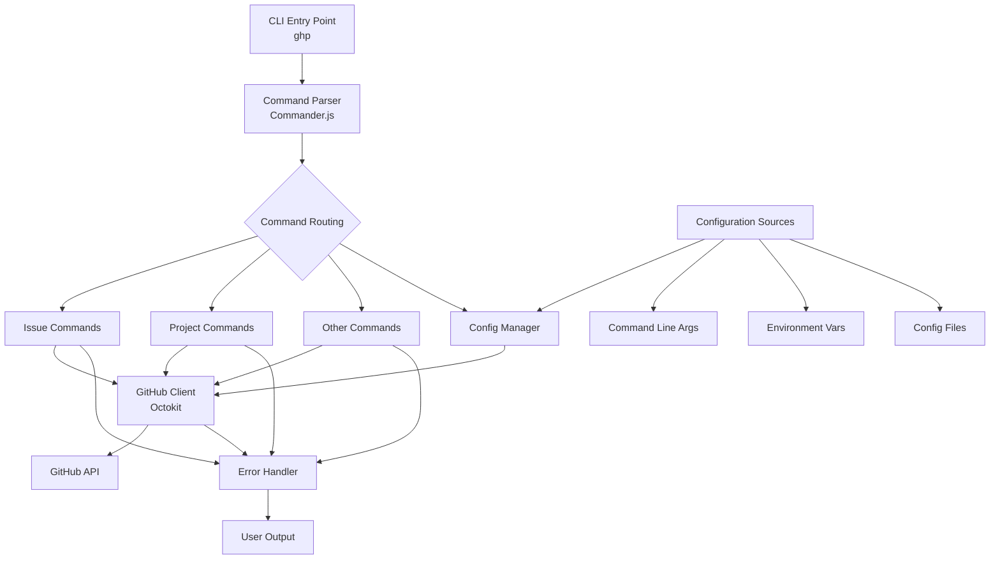

# GHP Connector Architecture Diagram

The following diagram illustrates the architecture of the GHP Connector CLI application.

## Component Descriptions

### Core Components

- **CLI Entry Point**: The main executable that users interact with (`ghp` command)
- **Command Parser**: Uses Commander.js to parse command line arguments and route to appropriate command handlers
- **Command Modules**: Separate modules for each resource type (issues, projects, etc.)
- **Config Manager**: Manages configuration from multiple sources
- **GitHub Client**: Octokit-based client for interacting with GitHub's API
- **Error Handler**: Centralized error processing and user-friendly messaging
- **Output Formatter**: Handles formatting output in different styles (human, JSON, etc.)

### Data Flow

1. User enters a command like `ghp issue list`
2. Commander.js parses the command and routes to the Issue command module
3. Issue module validates input and calls appropriate GitHub client methods
4. GitHub client uses configuration and makes API requests
5. Results are processed, formatted, and displayed to the user
6. Any errors are caught and handled by the error handler

## Design Principles

1. **Separation of Concerns**: Each component has a single responsibility
2. **Modularity**: Commands are organized by resource type for maintainability
3. **Consistent Interface**: All commands follow the same pattern
4. **Error Handling**: Centralized error processing with user-friendly messages
5. **Configuration Flexibility**: Multiple config sources with clear precedence 