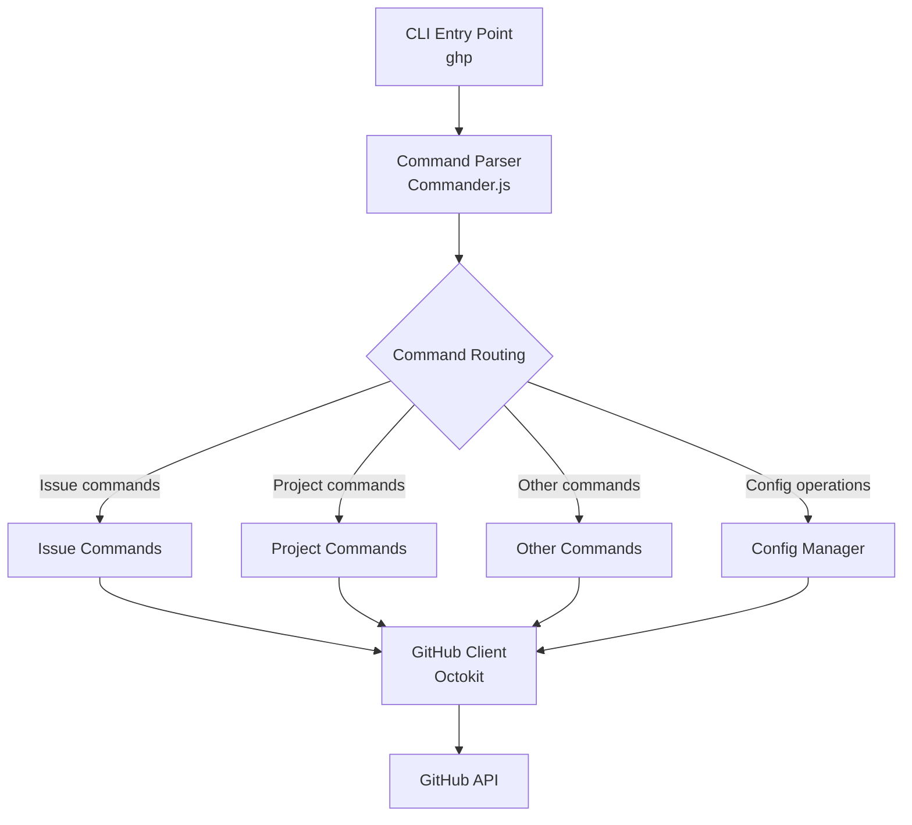
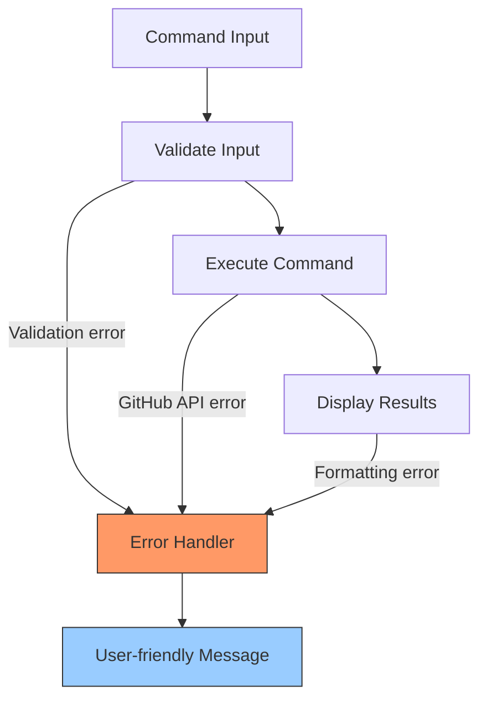
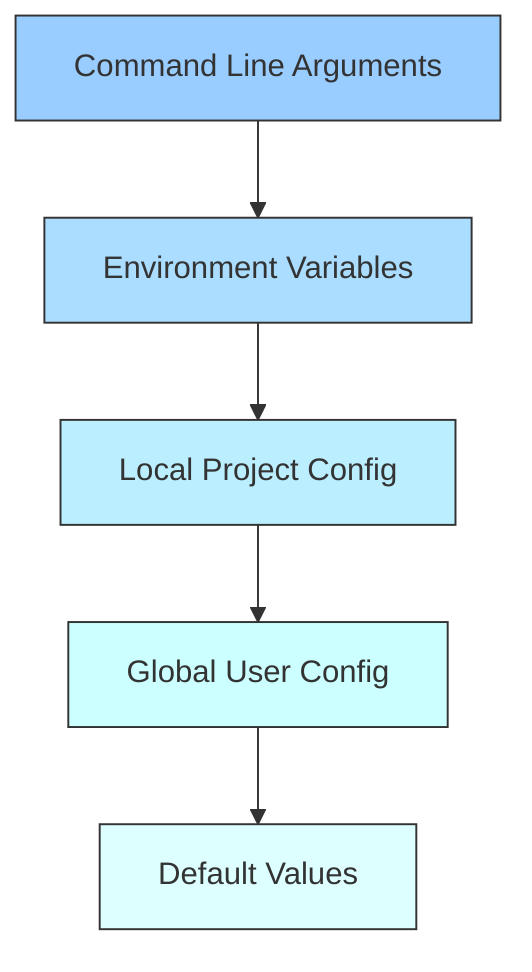

# GHP Connector - CLI Architecture & Library Selection

## Introduction

This document outlines the architecture decisions and library selections for the GHP Connector CLI. The goal is to define a solid foundation that is:

- Simple and intuitive for both human users and AI agents
- Maintainable and extensible
- Performant with minimal dependencies
- Focused on good user experience and error handling

## CLI Framework Selection

After evaluating several popular Node.js CLI frameworks, we have selected **Commander.js** for the GHP Connector CLI.

### Evaluation Criteria

| Framework | Pros | Cons |
|-----------|------|------|
| **Commander.js** | - Lightweight and simple<br>- Excellent TypeScript support<br>- Widely used (176M weekly downloads)<br>- Active maintenance<br>- Easy to learn<br>- Simple command structure | - Less structured than Oclif<br>- Fewer built-in features |
| **Yargs** | - Rich feature set<br>- Good community support<br>- Flexible configuration | - Heavier than Commander<br>- Not maintained as actively<br>- More complex API |
| **Oclif** | - Plugin architecture<br>- Built-in testing framework<br>- Supports command hierarchies<br>- Backed by Heroku | - More complex<br>- Steeper learning curve<br>- Generates more boilerplate code |
| **Vorpal** | - Interactive experience<br>- Command history<br>- Tab completion | - Not maintained (last updated 8 years ago)<br>- Primarily focused on interactive mode |

### Reasoning for Selecting Commander.js

1. **Simplicity**: Commander provides a straightforward API that aligns with our goal of creating an intuitive CLI.
2. **Active Maintenance**: Regular updates and bug fixes ensure long-term stability.
3. **Lightweight**: Minimal impact on package size and dependencies.
4. **TypeScript Support**: Built-in TypeScript declarations, essential for our TypeScript-based project.
5. **Community Adoption**: Widely used in the ecosystem, making it easy to find examples and resources.
6. **Low Learning Curve**: Easy for contributors to understand and extend.

## GitHub API Client Selection

After evaluating GitHub API client options, we have selected **Octokit** as our GitHub API client library.

### Evaluation Criteria

| Library | Pros | Cons |
|---------|------|------|
| **Octokit** | - Official GitHub SDK<br>- Complete API coverage<br>- Excellent TypeScript support<br>- Universal (works in browsers and Node.js)<br>- Plugin system<br>- Supports REST and GraphQL APIs | - Larger package size |
| **Axios + direct API calls** | - More control<br>- Lighter weight | - No type definitions for GitHub API<br>- Manual request handling<br>- More code to maintain |
| **node-github** | - Simpler API | - Less active maintenance<br>- Less comprehensive coverage |

### Reasoning for Selecting Octokit

1. **Official Support**: As the official GitHub SDK, it's designed to follow all recommended best practices.
2. **Complete API Coverage**: All GitHub API features are covered, ensuring we can implement any needed functionality.
3. **TypeScript Integration**: Excellent TypeScript declarations make development safer and more efficient.
4. **Future-proof**: Active maintenance ensures compatibility with GitHub API changes.
5. **GraphQL Support**: Built-in support for both REST and GraphQL APIs allows flexibility.
6. **Plugins**: Extensible architecture through plugins for specific features.

## Command Structure

The CLI will follow a consistent command structure:

```ghp <resource> <action> [options]
```

Where:
- `<resource>`: The GitHub resource type (e.g., issue, project)
- `<action>`: The operation to perform (e.g., list, create, update)
- `[options]`: Optional parameters for the command

### Example Commands

```bash
# List issues
ghp issue list

# Create an issue
ghp issue create --title "Bug report" --body "Description"

# Update an issue
ghp issue update --id 123 --status closed
```

### Naming Conventions

We will follow these conventions for command naming:

1. **Resources**: Singular form (e.g., `issue`, not `issues`)
2. **Actions**: Simple verb in present tense (e.g., `list`, `create`, `update`)
3. **Options**: Kebab-case with full words (e.g., `--issue-number`, not `--issue-num`)

## Architecture Overview



### Key Components

1. **CLI Entry Point**: Main executable that processes user input and routes to appropriate commands
2. **Command Parser**: Uses Commander.js to parse command line arguments
3. **Command Modules**: Separate modules for each resource type (issues, projects, etc.)
4. **Config Manager**: Handles loading and saving configuration settings
5. **GitHub Client**: Octokit-based API client to interact with GitHub

## Error Handling Strategy

Our error handling approach will focus on:

1. **User-friendly Messages**: Clear error messages that explain what went wrong
2. **Error Types**: Categorizing errors (network, authentication, validation)
3. **Exit Codes**: Consistent exit codes for different error types
4. **Debugging**: Optional verbose output for troubleshooting
5. **Error Logging**: Appropriate context for errors

### Error Handling Flow



## Output Formatting

The CLI will support multiple output formats:

1. **Human-readable**: Default formatted output for terminal users
2. **JSON**: Machine-readable output for scripting and integration
3. **Table**: Tabular format for lists and collections
4. **Minimal**: Quiet output for use in scripts (just IDs or essential info)

Example:

```bash
# Human-readable output
ghp issue list

# JSON output
ghp issue list --format json

# Table output
ghp issue list --format table

# Minimal output
ghp issue list --format minimal
```

## Configuration Management

Configuration will be managed through:

1. **Local Config File**: `.ghprc.json` in the user's home or project directory
2. **Environment Variables**: For secrets and temporary overrides
3. **Command Line Arguments**: For one-time parameter changes

### Configuration Precedence (highest to lowest)



### Example Configuration File

```json
{
  "github": {
    "owner": "username",
    "repo": "repository"
  },
  "defaults": {
    "format": "human",
    "issues": {
      "state": "open"
    }
  }
}
```

## Development Plan

1. Set up basic CLI structure with Commander.js
2. Implement configuration management
3. Create GitHub client using Octokit
4. Implement error handling utilities
5. Add issue management commands
6. Add project management commands
7. Add testing and documentation

## Conclusion

This architecture provides a solid foundation for the GHP Connector CLI. The selection of Commander.js and Octokit balances simplicity, maintainability, and feature completeness. The structured approach to commands, error handling, and configuration will ensure a good user experience for both human users and AI agents. 