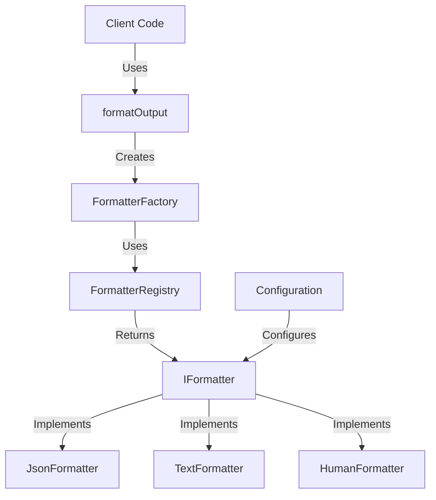
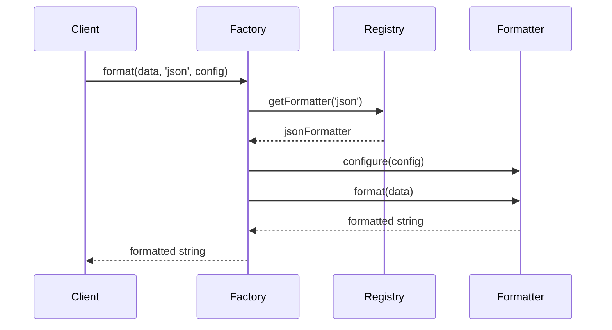
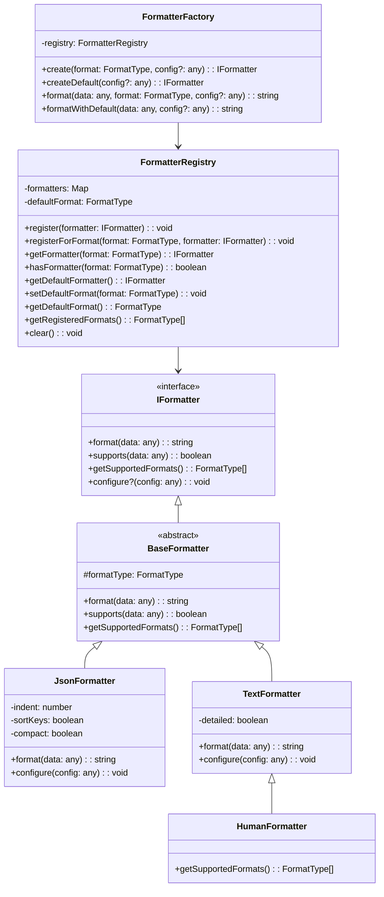

# Formatting System Usage Guide

This guide explains how to use the output formatting system in GHP Connector, both for CLI users and developers integrating with the library.

## Architecture Overview

The formatting system follows a modular architecture with clear separation of concerns:



## For CLI Users

When using the GHP Connector CLI, you can specify the output format with the `--format` option.

### Available Formats

- `human`: Human-readable format (default)
- `json`: JSON format for machine processing
  - Options: `--pretty` (boolean), `--indent=<number>`, `--compact` (boolean, default)
- `text`: Plain text format
  - Options: `--detailed` (boolean), `--no-colors` (boolean)

### Examples

```bash
# Default (human-readable) format
ghp issue list

# JSON format
ghp issue list --format=json

# Text format
ghp issue list --format=text
```

### Format-Specific Options

Some formats support additional options:

```bash
# JSON pretty-printed with default indentation (2 spaces)
ghp issue list --format=json --pretty

# JSON pretty-printed with custom indentation (4 spaces)
ghp issue list --format=json --pretty --indent=4

# JSON compact output (default, explicitly)
ghp issue list --format=json --compact

# Text with detailed output
ghp issue list --format=text --detailed

# Human-readable without colors (applies to text/human)
ghp issue list --format=human --no-colors
```

## For Developers

### Basic Usage

The simplest way to use the formatting system is with the `formatOutput` function:

```typescript
import { formatOutput } from 'ghp-connector';

// Get data (e.g., GitHub issues)
const issues = await getIssues();

// Format with default formatter (human-readable)
const output = formatOutput(issues);
console.log(output);

// Format as JSON
const jsonOutput = formatOutput(issues, 'json');
console.log(jsonOutput);
```

### With Configuration

You can pass configuration options to customize the formatter behavior:

```typescript
// JSON pretty-printed with indent 4
const prettyJson = formatOutput(issues, 'json', {
  pretty: true, // Enable pretty printing
  indent: 4, // Set indentation to 4 spaces
});

// JSON compact output (default behavior, but can be explicit)
const compactJson = formatOutput(issues, 'json', {
  compact: true, // Explicitly request compact output
});

// Text with detailed information
const detailedText = formatOutput(issues, 'text', {
  detailed: true,
  maxWidth: 120,
});
```

### Using Registry and Factory Directly

For more control, you can work with the registry and factory directly:

```typescript
import { FormatterRegistry, FormatterFactory, JsonFormatter, TextFormatter } from 'ghp-connector';

// Create registry and register formatters
const registry = new FormatterRegistry();
registry.register(new JsonFormatter());
registry.register(new TextFormatter());

// Set default format
registry.setDefaultFormat('json');

// Create factory
const factory = new FormatterFactory(registry);

// Format data
const output = factory.format(issues, 'json', { indent: 2 });

// Or use default formatter
const defaultOutput = factory.formatWithDefault(issues);
```

### Data Flow

The formatting process follows this sequence:



### Creating Custom Formatters

You can create custom formatters for specific needs:

```typescript
import { BaseFormatter, FormatType } from 'ghp-connector';

export interface CsvFormatterConfig {
  delimiter?: string;
  includeHeaders?: boolean;
}

export class CsvFormatter extends BaseFormatter {
  private delimiter: string = ',';
  private includeHeaders: boolean = true;

  constructor() {
    super('csv');
  }

  configure(config: CsvFormatterConfig): void {
    if (config.delimiter !== undefined) {
      this.delimiter = config.delimiter;
    }
    if (config.includeHeaders !== undefined) {
      this.includeHeaders = config.includeHeaders;
    }
  }

  format(data: any[]): string {
    if (!Array.isArray(data) || data.length === 0) {
      return '';
    }

    const rows: string[] = [];
    const headers = Object.keys(data[0]);

    // Add headers row
    if (this.includeHeaders) {
      rows.push(headers.join(this.delimiter));
    }

    // Add data rows
    for (const item of data) {
      const values = headers.map((header) => (item[header] !== undefined ? String(item[header]) : ''));
      rows.push(values.join(this.delimiter));
    }

    return rows.join('\n');
  }

  getSupportedFormats(): FormatType[] {
    return ['csv' as FormatType];
  }
}

// Register the formatter
import { defaultRegistry } from 'ghp-connector';
defaultRegistry.register(new CsvFormatter());

// Use it
const csvOutput = formatOutput(issues, 'csv' as FormatType, {
  delimiter: ';',
  includeHeaders: true,
});
```

### Error Handling

The formatting system provides specific errors for better error handling:

```typescript
import { UnsupportedFormatError, FormattingError } from 'ghp-connector';

try {
  const output = formatOutput(data, 'invalid-format' as FormatType);
} catch (error) {
  if (error instanceof UnsupportedFormatError) {
    console.error('Format not supported:', error.message);
  } else if (error instanceof FormattingError) {
    console.error('Formatting error:', error.message);
    if (error.originalError) {
      console.error('Original error:', error.originalError);
    }
  } else {
    console.error('Unknown error:', error);
  }
}
```

## Component Relationships

The following diagram shows the relationships between the formatting system components:



## Performance Tips

- For large datasets, consider using configuration options to limit output
- Use the right format for your use case: JSON for machine processing, human-readable for CLI display
- If formatting the same data multiple times, obtain a formatter instance once and reuse it
